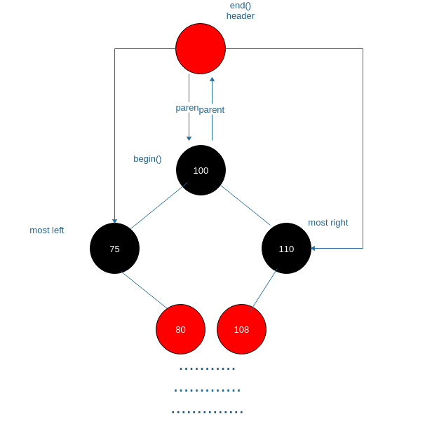
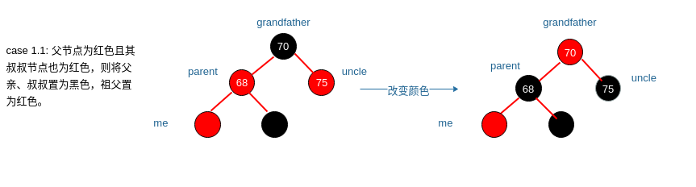
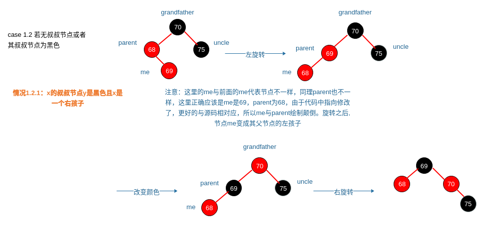
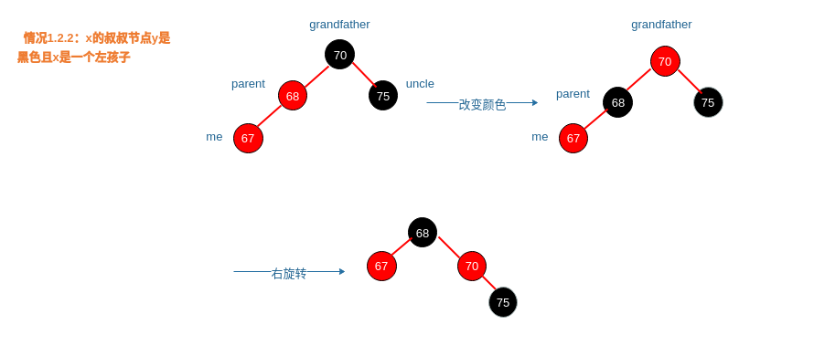
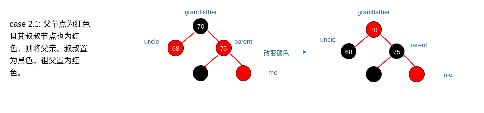
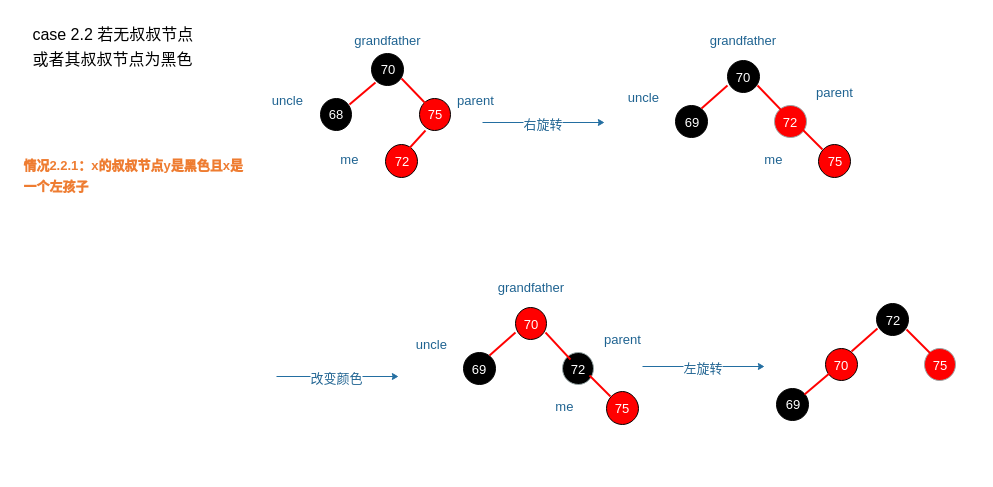
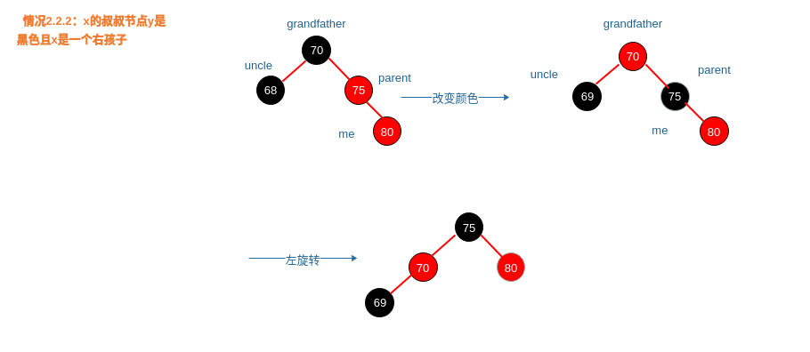
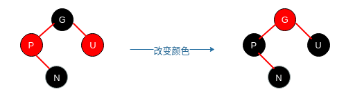
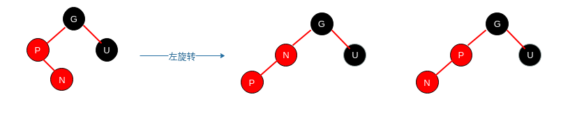
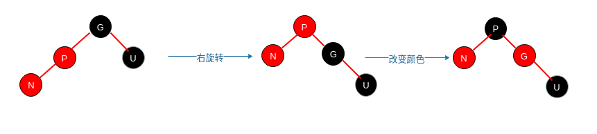

# Анализ исходного кода STL: Красно-черное дерево

## 0. Вступление

В исходном коде STL есть такие строки (простая адаптация):

В STL класс Red-black tree (красно-черное дерево) используется как контейнер отношений (например, set, multiset, map, multimap). Методы вставки и удаления основаны на книге «Introduction to Algorithms», однако есть два отличия:

(1) Header указывает не только на root, но также на самый левый и правый узлы дерева, чтобы можно было получать begin() за константное время, а связанные с set алгоритмы (например, set_union и т. д.) работали за линейное время.

(2) Если удаляемый узел имеет двух детей, то его преемник будет перемещён на его позицию, а не скопирован. Поэтому единственный невалидный итератор — тот, что указывал на удалённый узел.

Графически это можно представить так — по сравнению с обычным красно-черным деревом добавился header-узел (красный). Обычное красно-черное дерево начинается с узла 100 и подчинено пяти свойствам:

- Каждый узел либо красный, либо чёрный.
- Корень всегда чёрный.
- Каждый листовой узел (NULL) всегда чёрный.
- Если узел красный, его потомки обязательно чёрные.
- Для каждого узла количество чёрных узлов на всех простых путях до листьев одинаково.

rb_tree тоже подчиняется этим свойствам. Итератор begin указывает на корень дерева (то есть на родителя header), а end указывает на сам header.



## 1. Базовый класс узла красно-черного дерева

Базовый класс очень прост, в начале файла определяется перечисление цветов.

В базовом классе содержатся указатели на родителя, левого и правого ребёнка, а также признак цвета. Два основных метода возвращают минимальный и максимальный узлы красно-черного дерева. Для поиска минимума надо идти по левым детям, для максимума — по правым.

```cpp
// Цвета
enum _Rb_tree_color { _S_red = false, _S_black = true };

// Базовый класс
struct _Rb_tree_node_base
{
    typedef _Rb_tree_node_base* _Base_ptr;

    _Rb_tree_color _M_color;
    _Base_ptr _M_parent;
    _Base_ptr _M_left;
    _Base_ptr _M_right;

    static _Base_ptr _S_minimum(_Base_ptr __x) _GLIBCXX_NOEXCEPT
    {
        while (__x->_M_left != 0) __x = __x->_M_left;
        return __x;
    }

    static _Base_ptr _S_maximum(_Base_ptr __x) _GLIBCXX_NOEXCEPT
    {
        while (__x->_M_right != 0) __x = __x->_M_right;
        return __x;
    }

};
```


## 2. Узел красно-черного дерева

Узел наследует базовый узел:

```cpp
template<typename _Val>
struct _Rb_tree_node : public _Rb_tree_node_base
{
    typedef _Rb_tree_node<_Value>* _Link_type; // указатель на узел
    _Value _M_value_field; // данные (ключ)
};
```


## 3. Итератор красно-черного дерева

Итератор включает один член — указатель на базовый узел, на основе которого реализованы все операции.
По сути, этот итератор — двунаправленный (bidirectional_iterator_tag).

Внутри есть typedef'ы, необходимые для итератора.

```cpp
template<typename _Tp>
struct _Rb_tree_iterator
{
    typedef _Tp  value_type;
    typedef _Tp& reference;
    typedef _Tp* pointer;

    typedef bidirectional_iterator_tag iterator_category;
    typedef ptrdiff_t                  difference_type;

    typedef _Rb_tree_iterator<_Tp>        _Self;
    typedef _Rb_tree_node_base::_Base_ptr _Base_ptr;
    typedef _Rb_tree_node<_Tp>*           _Link_type;

    _Base_ptr _M_node;
};   
```

Получение данных:

```cpp
reference
operator*() const _GLIBCXX_NOEXCEPT
{ return *static_cast<_Link_type>(_M_node)->_M_valptr(); }

pointer
operator->() const _GLIBCXX_NOEXCEPT
{ return static_cast<_Link_type> (_M_node)->_M_valptr(); }
```

Оператор ++:

```cpp
_Self&
operator++() _GLIBCXX_NOEXCEPT
{
    _M_node = _Rb_tree_increment(_M_node);
    return *this;
}
```

Внутренняя реализация _Rb_tree_increment такова:

```cpp
static _Rb_tree_node_base *
local_Rb_tree_increment( _Rb_tree_node_base* __x ) throw ()
{
    if ( __x->_M_right != 0 ) {
        __x = __x->_M_right;
        while ( __x->_M_left != 0 )
            __x = __x->_M_left;
    } else  {                        
        _Rb_tree_node_base *__y = __x->_M_parent;
        while ( __x == __y->_M_right )
        {
            __x= __y;
            __y= __y->_M_parent;
        }
        if ( __x->_M_right != __y )
            __x = __y;
    }
    return (__x);
}
```

Оператор --:

```cpp
_Self&
operator--() _GLIBCXX_NOEXCEPT
{
    _M_node = _Rb_tree_decrement(_M_node);
    return *this;
}
```

Внутренняя реализация _Rb_tree_decrement:

```cpp
static _Rb_tree_node_base *
local_Rb_tree_decrement( _Rb_tree_node_base * __x )
throw ()
{
    if ( __x->_M_color ==
         _S_red
         && __x
         ->_M_parent->_M_parent == __x )
        __x = __x->_M_right;
    else if ( __x->_M_left != 0 ) {
        _Rb_tree_node_base *__y = __x->_M_left;
        while ( __y->_M_right != 0 )
            __y = __y->_M_right;
        __x = __y;
    } else  {
        _Rb_tree_node_base *__y = __x->_M_parent;
        while ( __x == __y->_M_left )
        {
            __x= __y;
            __y= __y->_M_parent;
        }
        __x = __y;
    }
    return (__x);
}
```

Переопределение == и != — сравнение указателей.

```cpp
bool
operator==(const _Self& __x) const _GLIBCXX_NOEXCEPT
{ return _M_node == __x._M_node; }

bool
operator!=(const _Self& __x) const _GLIBCXX_NOEXCEPT
{ return _M_node != __x._M_node; }

```

Функция подсчёта чёрных узлов:

```cpp
unsigned int
_Rb_tree_black_count(const _Rb_tree_node_base *__node,
                     const _Rb_tree_node_base *__root) throw() {
    if (__node == 0)
        return 0;
    unsigned int __sum = 0;
    do {
        if (__node->_M_color == _S_black)
            ++__sum;
        if (__node == __root)
            break;
        __node = __node->_M_parent;
    } while (1);
    return __sum;
}
```

Далее — разбор вставки.

## 4. Операции над красно-черным деревом

Здесь важно, что для хранения используют указатель на базовый узел, а также специальную структуру _Rb_tree_impl, отвечающую за инициализацию и управление памятью. Также предусмотрены прямой и обратный итераторы (rbegin/rend).

```cpp
template<typename _Key, typename _Val, typename _KeyOfValue,
           typename _Compare, typename _Alloc = allocator<_Val> >
class _Rb_tree
{
protected:
    typedef _Rb_tree_node_base* _Base_ptr;

    template<typename _Key_compare, 
        bool _Is_pod_comparator = __is_pod(_Key_compare)>
    struct _Rb_tree_impl : public _Node_allocator
    {
        _Key_compare _M_key_compare;
        _Rb_tree_node_base _M_header;
        size_type _M_node_count; // количество элементов

        _Rb_tree_impl()
        : _Node_allocator(), _M_key_compare(), _M_header(),
          _M_node_count(0)
        { _M_initialize(); }

        _Rb_tree_impl(const _Key_compare& __comp, const _Node_allocator& __a)
        : _Node_allocator(__a), _M_key_compare(__comp), _M_header(),
          _M_node_count(0)
        { _M_initialize(); }

    private:
        void
        _M_initialize()
        {
            this->_M_header._M_color = _S_red;
            this->_M_header._M_parent = 0;
            this->_M_header._M_left = &this->_M_header;
            this->_M_header._M_right = &this->_M_header;
        } 
    };
public: 
    typedef _Rb_tree_iterator<value_type>       iterator;
    typedef std::reverse_iterator<iterator>     reverse_iterator; 
private:
    _Rb_tree_impl<_Compare> _M_impl;
};
```

> Получить указатели на root, самый левый и правый узлы

```cpp
// Корень (узел 100 на схеме)
_Base_ptr&
_M_root() _GLIBCXX_NOEXCEPT
{ return this->_M_impl._M_header._M_parent; }

// Самый левый
_Base_ptr&
_M_leftmost() _GLIBCXX_NOEXCEPT
{ return this->_M_impl._M_header._M_left; }

// Самый правый
_Base_ptr&
_M_rightmost() _GLIBCXX_NOEXCEPT
{ return this->_M_impl._M_header._M_right; }

// begin()
_Link_type
_M_begin() _GLIBCXX_NOEXCEPT
{ return static_cast<_Link_type>(this->_M_impl._M_header._M_parent); }

// end()
_Link_type
_M_end() _GLIBCXX_NOEXCEPT
{ return reinterpret_cast<_Link_type>(&this->_M_impl._M_header); }

```


## 5. Вставка в красно-черное дерево

### 5.1 Операции вращения

Левый поворот: правый ребёнок становится родителем текущего узла, а сам узел — левым ребёнком бывшего правого:

```cpp
//    _x                      _y
//  /   \     Левый поворот  /  \
// T1   _y   --------->    _x    T3
//     / \                /   \
//    T2 T3              T1   T2
void leftRotate(Node *_x) {
    Node *_y = _x->right;
    _x->right = _y->left;
    if (NULL != _y->left)
        _y->left->parent = _x;

    _y->parent = _x->parent;
    if (_x == root)
        root = _y;
    else if (_x == _x->parent->left)
        _x->parent->left = _y;
    else
        _x->parent->right = _y;

    _y->left = _x;
    _x->parent = _y;
}
```


Правый поворот:

```cpp
//        _x                      _y
//      /   \     Правый поворот /  \
//     _y    T2 -------------> T0   _x
//    /  \                          /  \
//   T0  T1                        T1  T2
void rightRotate(Node *_x) {
    Node *_y = _x->left;
    _x->left = _y->right;
    if (NULL != _y->right)
        _y->right->parent = _x;

    if (_x == root)
        root = _y;
    else if (_x == _x->parent->right)
        _x->parent->right = _y;
    else
        _x->parent->left = _y;

    _y->right = _x;
    _x->parent = _y;
}
```

case 1.1: Отец — красный, дядя — красный; отец и дядя становятся чёрными, дед — красным.

case 1.2: Дяди нет или он чёрный, здесь два варианта:

Случай 1.2.1: дядя чёрный, а N — правый ребёнок


Случай 1.2.2: дядя чёрный, а N — левый ребёнок


Фрагмент исходного кода:

```cpp
_Rb_tree_node_base *const __y = __xpp->_M_right;    // дядя
if (__y && __y->_M_color == _S_red)     // дядя есть и он красный
{
    __x->_M_parent->_M_color = _S_black;    // отец становится чёрным
    __y->_M_color = _S_black;               // дядя становится чёрным
    __xpp->_M_color = _S_red;               // дед становится красным
    __x = __xpp;                            // поднимаемся выше
} else {        // нет дяди или дядя чёрный
    if (__x == __x->_M_parent->_M_right) {          // N — правый ребенок
        __x = __x->_M_parent;
        local_Rb_tree_rotate_left(__x, __root);     // левый поворот по отцу
    }
    __x->_M_parent->_M_color = _S_black;            // отец становится чёрным
    __xpp->_M_color = _S_red;                       // дед становится красным
    local_Rb_tree_rotate_right(__xpp, __root);      // правый поворот по деду
}
```

Другой случай — зеркально.

case 2.1: Отец — красный, дядя — красный; отец и дядя становятся черными, дед красным.

case 2.2: Дяди нет или он чёрный:

case 2.2.1: Узел y дяди x черный, а x - левый дочерний узел

```cpp
_Rb_tree_node_base *const __y = __xpp->_M_left; // дядя
if (__y && __y->_M_color == _S_red) {       // дядя есть и он красный
    __x->_M_parent->_M_color = _S_black;    // отец — чёрный
    __y->_M_color = _S_black;               // дядя — чёрный
    __xpp->_M_color = _S_red;
    __x = __xpp;
} else {        // нет дяди или дядя чёрный
    if (__x == __x->_M_parent->_M_left) {   // N — левый ребенок
        __x = __x->_M_parent;
        local_Rb_tree_rotate_right(__x, __root);    // правый поворот по отцу
    }
    __x->_M_parent->_M_color = _S_black;        // отец — чёрный
    __xpp->_M_color = _S_red;                   // дед — красный
    local_Rb_tree_rotate_left(__xpp, __root);   // левый поворот по деду
}
```

Вся функция вставки и балансировки:

```cpp
void
_Rb_tree_insert_and_rebalance(const bool __insert_left,
                              _Rb_tree_node_base *__x,
                              _Rb_tree_node_base *__p,
                              _Rb_tree_node_base &__header) throw() {
    _Rb_tree_node_base * &__root = __header._M_parent;

    __x->_M_parent = __p;
    __x->_M_left = 0;
    __x->_M_right = 0;
    __x->_M_color = _S_red;

    // Обработка header
    if (__insert_left) {
        __p->_M_left = __x;

        if (__p == &__header) {
            __header._M_parent = __x;
            __header._M_right = __x;
        } else if (__p == __header._M_left)
            __header._M_left = __x;
    } else {
        __p->_M_right = __x;

        if (__p == __header._M_right)
            __header._M_right = __x;
    }

    while (__x != __root
           && __x->_M_parent->_M_color == _S_red)
    {
        _Rb_tree_node_base *const __xpp = __x->_M_parent->_M_parent;

        if (__x->_M_parent == __xpp->_M_left)
        {
            _Rb_tree_node_base *const __y = __xpp->_M_right;
            if (__y && __y->_M_color == _S_red)
            {
                __x->_M_parent->_M_color = _S_black;
                __y->_M_color = _S_black;
                __xpp->_M_color = _S_red;
                __x = __xpp;
            } else {
                if (__x == __x->_M_parent->_M_right) {
                    __x = __x->_M_parent;
                    local_Rb_tree_rotate_left(__x, __root);
                }
                __x->_M_parent->_M_color = _S_black;
                __xpp->_M_color = _S_red;
                local_Rb_tree_rotate_right(__xpp, __root);
            }
        } else {
            _Rb_tree_node_base *const __y = __xpp->_M_left;
            if (__y && __y->_M_color == _S_red) {
                __x->_M_parent->_M_color = _S_black;
                __y->_M_color = _S_black;
                __xpp->_M_color = _S_red;
                __x = __xpp;
            } else {
                if (__x == __x->_M_parent->_M_left) {
                    __x = __x->_M_parent;
                    local_Rb_tree_rotate_right(__x, __root);
                }
                __x->_M_parent->_M_color = _S_black;
                __xpp->_M_color = _S_red;
                local_Rb_tree_rotate_left(__xpp, __root);
            }
        }
    }
    __root->_M_color = _S_black;
}
```


### 5.2 Итог по вставке

Итак, согласно исходному коду и анализу, видим три ситуации:
Допустим, P — родитель, N — новый узел, U — дядя, G — дед.

case 1: Если U (дядя) — красный, а P (родитель) и N тоже красные, то можно просто поменять цвета, рекурсивно продолжая обработку вверх по дереву — теперь новая вершина N становится G (дедом) и снова применяются те же правила. Если в результате корень оказывается красным, на последнем шаге перекрашиваем root в черный.


Если U — черный, нужно учитывать, левый N или правый.

case 2.1: Если N — правый ребенок P, выполняется левый поворот, после чего задача сводится к следующей ситуации.



Эта ситуация может возникнуть после case 2.1, но не обязательно! Действие: правый поворот и смена цветов.



Удаление реализовано сложнее, здесь оно не рассматривается.

## 6. Использование

Как использовать?

Подключить заголовок:

```
#include<map> или <set>
```

Завести объект класса:

```
_Rb_tree<int, int, _Identity<int>, less<int>> itree;
```

Дальше можно вызывать обычные методы работы с деревом.


